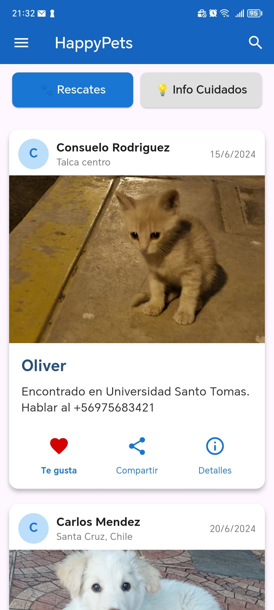
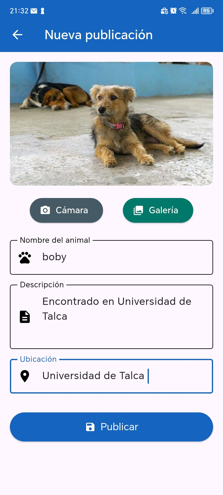
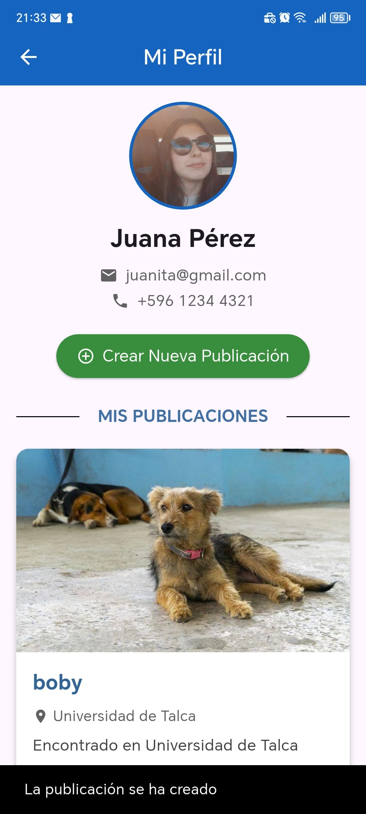
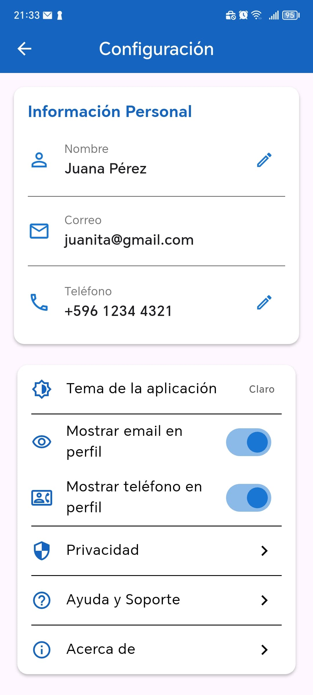
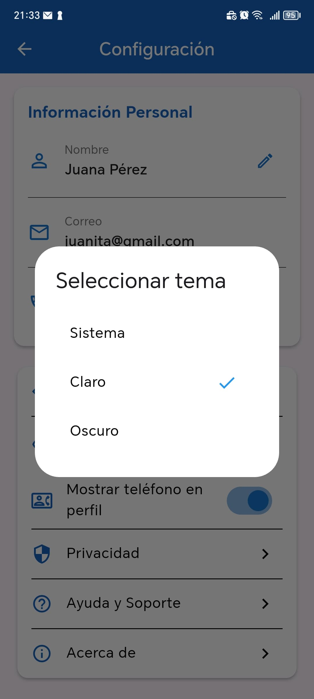
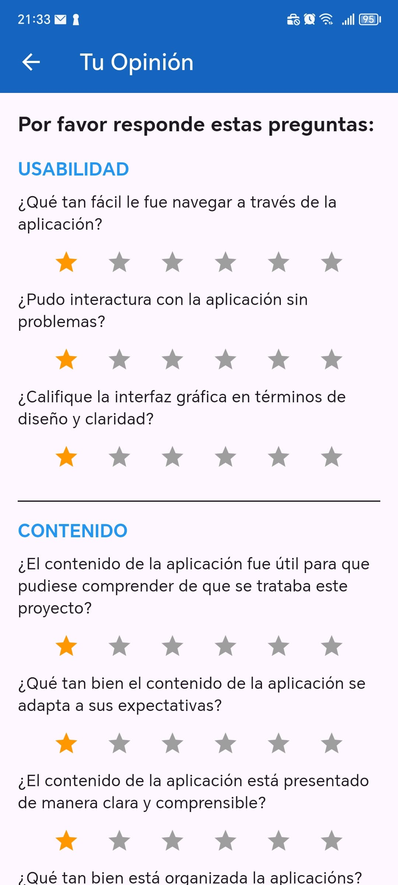

# HappyPets

**Curso:** Programación de Dispositivos Móviles 2025/1
**Desarrollador:** Fabián Arévalo Valenzuela
**Profesor:** Manuel Moscoso

**IMPORTANTE AL INCIAR**
**Usuario:** juanita@gmail.com
**Contraseña:** 12345678

## Descripción

HappyPets es una aplicación movil desarrollada en Flutter para conectar animales en situación de adopción con personas interesadas, además ofrece una sección informativa sobre cuidados a diferentes especies de animales y razas. Surge como proyecto academico en la Universidad de Talca, en el curso de Progración de Dispositivos Moviles, con el objetivo de promover adopciones responsables y educación sobre cuidados de animales.

## Funcionalidades Principales:

*   **Autenticación de Usuarios:**
    *   Pantalla de inicio de sesión (SplashScreen con formulario).
    *   Una credencial predefinidas para demostración.
    *   Opción "Recordar inicio sesión" usando SharedPreferences.

*   **Visualización de Mascotas para Rescate/Adopción (HomePage):**
    *   Listado de publicaciones de mascotas disponibles.
    *   Datos cargados desde una base de datos local (SQLite), incluyendo datos iniciales y posts creados por el usuario.
    *   Botones de interacción visual (Me gusta es el unico que funciona por el momento).

*   **Información sobre Cuidados de Mascotas (HomePage):**
    *   Sección con información desplegable sobre diferentes razas/tipos de animales.

*   **Perfil de Usuario (ProfilePage):**
    *   Visualización de información del perfil (foto de ejemplo, nombre, correo, teléfono).
    *   Listado de publicaciones creadas por el propio usuario.
    *   Opción para crear nuevas publicaciones de mascotas.
    *   Opción para eliminar publicaciones creadas por el usuario (desde la base de datos).

*   **Creación de Nuevas Publicaciones:**
    *   Formulario para ingresar nombre del animal, descripción, ubicación.
    *   Selección de imagen desde la cámara o galería del dispositivo.
    *   Guardado de la nueva publicación en la base de datos local (SQLite).

*   **Configuración de la Aplicación (ConfigurationPage):**
    *   Edición de información personal del usuario (Nombre, Teléfono).
    *   Selección de tema de la aplicación (Claro, Oscuro, Sistema(claro por defecto)), persistido con SharedPreferences.
    *   Opciones para mostrar/ocultar correo y teléfono en el perfil.
    *   Acceso a "Ayuda y Soporte" y "Acerca de".
    *   Opción para cerrar sesión.

*   **Sección "Acerca de" (AboutPage):**
    *   Información sobre el proyecto, desarrollador y curso.
    *   Acceso a la pantalla de Feedback/Opinión.

*   **Sistema de Feedback/Opinión (FeedbackPage):**
    *   Formulario con preguntas cargadas desde un archivo JSON local.
    *   Registro de identificación del usuario (nombre).
    *   Envío de la retroalimentación por correo electrónico a una dirección predefinida.

*   **Persistencia de Datos:**
    *   Uso de `SharedPreferences` para preferencias de usuario (tema, visibilidad de info, credenciales recordadas).
    *   Uso de `SQLite` para la persistencia de las publicaciones de mascotas.

*   **Navegación:**
    *   Uso de Drawer para navegación principal.
    *   Navegación entre pantallas mediante `Navigator.push`, `Navigator.pop`, y `Navigator.pushNamed`.

## DIAGRAMAS
 
### Diagrama de Acceso a la Información

### Diagrama de flujo principal (Agregar Publicaciones)

## CAPTURAS

1. Pantalla de Inicio 

2. Página Principal (Pestaña Rescates)

3. Página Principal (Pestaña Info Cuidados)

4. Perfil de Usuario (ProfilePage)

5. Crear Nueva Publicación

6. Configuración 

7. Selección de Tema

8. Acerca de

9. Feedback/Opinión

## Archivo De Instalación

Puedes descargar el archivo APK de depuración para instalar la aplicación en un dispositivo Android desde el siguiente enlace:

*   [Descargar Debug APK (app-debug.apk)](apk/happypets.apk)

## Instrucciones de Instalación

**Descargar APK**

**-Instalar APK**

**-Iniciar Sesión****

    **Correo:** juanita@gmail.com

    **Contraseña:** 12345678

**Así se simple**

## Video Explicativo

**Link:** xxxxxxx

## Tecnologias Utilizadas

-Framework: Flutter 

-Lenguaje: Dart 

-Base de Datos Local: SQLite

-Gestión de Preferencias: shared_preferences

-Selección de Imagenes: image_picker

-Lanzador de URLs (para correo): url_launcher

-IDE: Visual Studio Code/Android Studio

-Control de Versiones: Git y GitHub

